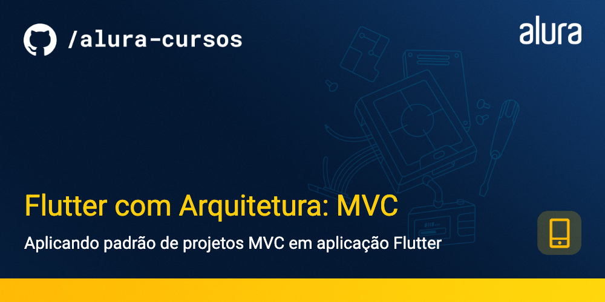

# Flutter com Arquitetura: MVC

Projeto Meu Pequeno Grimório para o curso de Flutter com Arquitetura: MVC, focado em utilizar o padrão de projeto MVC em um projeto Flutter.

### Tópicos abordados no curso:

- O que é MVC;
- Como estruturar o projeto seguindo o padrão MVC;
- Trabalhar em conjunto com outras pessoas dentro de um projeto;
- Planejamento e definição de arquitetura.

Este curso é indicado para pessoas que já tem conhecimento intermediário e querem aprofundar seu conhecimento em Flutter, seguindo boas práticas e também entendendendo como funciona arquitetura de software dentro dos padrões mobile.

## 📑 Requisitos

- Conhecimentos intermediários de Flutter e Dart;
- Android Studio ou VS Code (com plugins do Flutter e Dart instalados);
- É importante ter o Flutter na versão 3.10.2.

## ✨ Funcionalidades do projeto

- Buscar livros da API do GoogleBook;
- Salvar uma entrada no banco de dados;
- Adicionar comentários, data de início de leitura e final de leitura;
- Deletar uma entrada;
- Editar uma entrada;

  

 

## 🛠️ Abrir e rodar o projeto

Aqui vem um passo a passo para abrir e rodar o projeto.

- **Open an Existing Project** (ou alguma opção similar)
- Procure o local onde o projeto está e o selecione (Caso o projeto seja baixado via zip, é necessário extraí-lo antes de procurá-lo)
- Por fim clique em OK
- Depois basta rodar o comando `flutter run` na pasta do projeto
